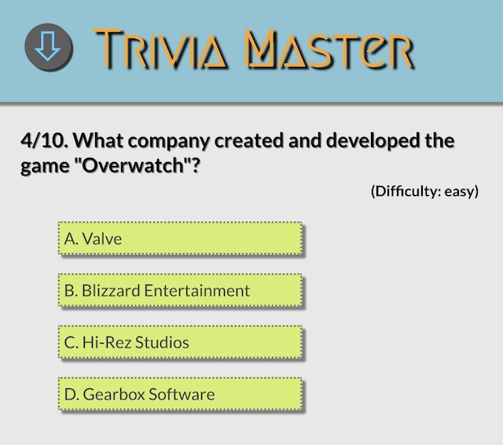

# Trivia Master

[Let's Play!](http://www.chaofan.live/trivia_master/)

Trivia Master is a browser quiz game. Players can choose question category and difficulty to answer
questions. The game is designed with role-playing game system. The character can gain EXP after correctly answering a question, but will lose HP if the answer is wrong. The character will level up if certain experience points are gained, and the game will be over if the character loses all of the HP.

## Technology

* HTML5/CSS3
* jQuery
* Question data source: [Open Trivia Database](https://opentdb.com/)

## Game System

### Questions

Player will answer 10 multiple choice questions in each round. Before each round, player needs to choose the question category and difficulty. Different difficulty will have different reward.

### Character

* LV: The current level of the character. The max level is 20.

* EXP: Experience points. Player can gain EXP by correctly answering the question based on the question difficulty:
  * Easy: +3 points
  * Medium: +4 points
  * Hard: +5 points

  Player will level up after gaining a certain amount of EXP, after leveling up, player's HP will be full.

* HP: Health points. Player will lose HP after choosing the wrong answer. If the HP become 0 and no elixir in the item bag, the game will be over. Maximum HP will be increased after level-up. The amount of lost HP is based on the question difficulty:
  * Easy: -1 HP
  * Medium: -2 HP
  * Hard: -3 HP

* COINS: The currency in the game. Player can use coins to purchase items, which is helpful for player to play the game. Player will gain coins after correctly answering a question based on the difficulty:
  * Easy: +2 coins
  * Medium: +3 coins
  * Hard: +4 coins

### STORE

In the store, player can use coins to buy items. These items are:

* Hint: Eliminates a wrong option from the question. Price: 10 coins
* Potion: Increases current HP by 5 points.
* Magic Capsule: Increases Max HP by 10 points.
* Elixir: Automatically revives the player if the player's HP becomes 0
